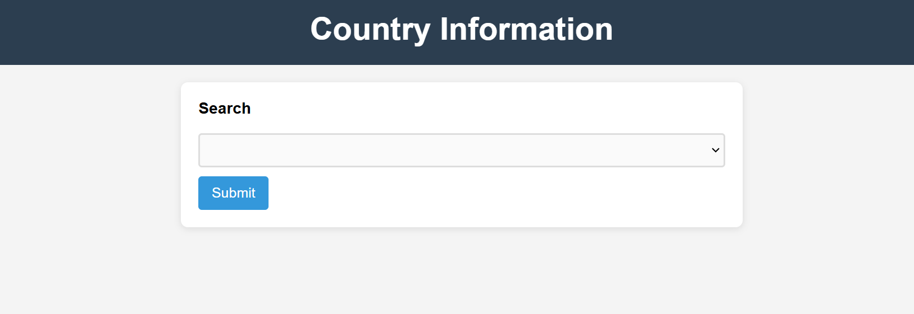
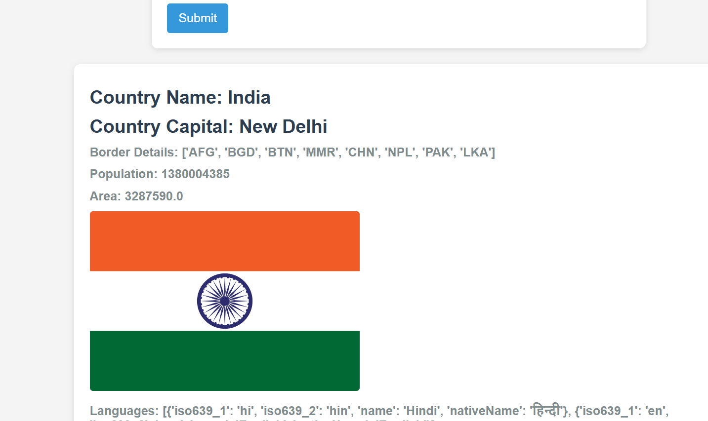

# Country Information API Project

## Overview
This project is a web application built using Django that provides detailed information about any country. The application fetches country data from an external API and displays details such as the country's name, flag, capital, currencies, languages, and population.

## Features
- **Search by Country Name**: Users can search for any country by entering its name.
- **Detailed Country Information**: The application displays the following details for each country:
  - Country Name
  - Flag (image)
  - Capital
  - Currencies
  - Languages
  - Population

## Technologies Used
- **Django**: Backend framework to handle server-side logic and routing.
- **HTML/CSS**: For creating the user interface.
- **JavaScript**: For enhancing user interactions.
- **Bootstrap**: To make the application responsive and visually appealing.
- **REST API**: To fetch country data from an external country information API.

## Installation
1. Clone the repository:
   ```bash
   git clone https://github.com/your-username/country-api-project.git
   ```
2. Navigate to the project directory:
   ```bash
   cd country-api-project
   ```
3. Create a virtual environment:
   ```bash
   python -m venv env
   ```
4. Activate the virtual environment:
   - On Windows:
     ```bash
     .\env\Scripts\activate
     ```
   - On macOS/Linux:
     ```bash
     source env/bin/activate
     ```
   ```
5. Run the server:
   ```bash
   python manage.py runserver
   ```
6. Open your browser and navigate to `http://localhost:8000` to view the application.

## Usage
1. Enter the name of the country you want to search for in the search bar.
2. Click the "Search" button.
3. The application will display the country's details including the flag, capital, currencies, languages, and population.

### Home Page Snapshot
Below is a snapshot of the home page with the search field:



### Country Details Snapshot
After searching for a country, the application displays its details as shown in the snapshot below:



## API Integration
The project integrates with a country information API to retrieve real-time data. The API returns detailed information about countries in a structured format.

## Project Structure
```
publicapi/
├── manage.py
├── country_api/
│   ├── migrations/
│   ├── static/
│   ├── templates/
│   ├── __init__.py
│   ├── admin.py
│   ├── apps.py
│   ├── models.py
│   ├── tests.py
│   └── views.py
└── requirements.txt
```

## Future Enhancements
- Add country comparison functionality.
- Implement user authentication for personalized experiences.
- Cache API responses to improve performance.

## License
This project is licensed under the MIT License. Feel free to use and modify it as per your needs.

